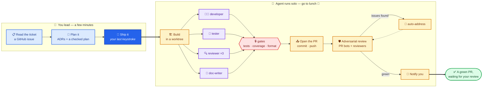

# dugout

Companion repo for the talk **"From Sidebar to Sub-Agents: A Live, Hands-On Intro to Building with AI Agents."**

**Slides:** [www.kylehoehns.com/talks/sidebar-to-subagents](https://www.kylehoehns.com/talks/sidebar-to-subagents)

This repo is a **game with levels**. It starts as a plain Spring Boot project with
**zero** AI involvement, and each level adds one new way of working with an AI
coding agent — from asking questions in a sidebar, to letting the agent edit and
test your code, to a whole team of AI sub-agents shipping a feature through a real
pull request.

**Every level is its own branch you can open and run.** So you don't just read
about each step — you can check it out, run it, and poke at it yourself.

The domain is baseball — `Player`s and their stats — because it's easy to read at
a glance. You don't need to know baseball (or Java) to follow along.

## New here? Start here

1. **You're on `main` right now** — that's Level 0: the plain starting point, no AI yet.
2. **The levels below are links.** Click one to browse that branch on GitHub and see
   exactly what got added.
3. Want to run a level on your own machine? Clone the repo and
   `git checkout stage-3` (or any level), then [run it](#run-it).

> On GitHub you can also use the **branch dropdown** near the top-left of the file
> list to jump between levels — every `stage-N` branch is one of these levels.

## The levels

`main` is the blank starting point. Each `stage-N` branch builds on the one before
it, so you can walk them in order and watch the project level up one step at a time.

| Level | Branch | What you'll find there |
|-------|--------|------------------------|
| **0** | [`main`](https://github.com/kylehoehns/dugout/tree/main) | The plain starting line — a bare Spring Boot app with one tiny `GET /api/players`. **No AI involved.** |
| **1** | [`stage-1`](https://github.com/kylehoehns/dugout/tree/stage-1) | **AI as a smarter search box** — you ask questions in the sidebar and paste snippets in yourself. The AI doesn't touch your files. |
| **2** | [`stage-2`](https://github.com/kylehoehns/dugout/tree/stage-2) | **Assisted editing** — you describe what you want in plain English and the AI edits your files for you. |
| **3** | [`stage-3`](https://github.com/kylehoehns/dugout/tree/stage-3) | **Agent mode** — the AI adds a database, runs the build, and fixes its own mistakes. Adds `AGENTS.md` so the AI knows the project's house rules. |
| **4** | [`stage-4`](https://github.com/kylehoehns/dugout/tree/stage-4) | **Your first custom skill** — a reusable instruction (`writing-tests`) that kicks in automatically whenever tests get written. |
| **5** | [`stage-5`](https://github.com/kylehoehns/dugout/tree/stage-5) | **Quality gates** — test coverage, auto-formatting, and CI, so the AI's work is held to a real standard. |
| **6** | [`stage-6`](https://github.com/kylehoehns/dugout/tree/stage-6) | **A team of sub-agents** — one skill directs a developer, a tester, reviewers, and a doc-writer to build a whole feature together. |
| **7** | [`stage-7`](https://github.com/kylehoehns/dugout/tree/stage-7) | **The team ships like a real dev** — from a written spec, the agents open a pull request, wait for CI, read the code-review feedback, verify the running app, and ping your phone when it's done. *Start from [`stage-7-start`](https://github.com/kylehoehns/dugout/tree/stage-7-start) to build it yourself.* |
| **8** | [`stage-8`](https://github.com/kylehoehns/dugout/tree/stage-8) | **Start from a GitHub issue** — the AI grills the issue into a sharp spec, writing decision records ([`docs/adr/`](https://github.com/kylehoehns/dugout/tree/stage-8/docs/adr)) and a domain glossary ([`CONTEXT.md`](https://github.com/kylehoehns/dugout/blob/stage-8/CONTEXT.md)) as it goes, then the team ships it. *Start from [`stage-8-start`](https://github.com/kylehoehns/dugout/tree/stage-8-start) to build it yourself.* |

Every level is a finished branch you can browse and run. Levels 7 and 8 also have
a `-start` scaffold — check that out and run the [follow-along prompt](#the-levels)
to build the level yourself, the way it's done live on stage.

```bash
git checkout stage-3   # jump to any level on your own machine
```

<details>
<summary><strong>Follow along — the exact prompts to try at each level</strong></summary>

<br>

Check out a level, [run it](#run-it), then type these into your AI assistant to
reproduce what the level demonstrates.

**Level 1 — ask in the sidebar (the AI advises; you make the edits):**
> How do I add an endpoint to return a single player by id from this hardcoded list?

> What if the id isn't found?

**Level 2 — let it edit your files:**
> The player data is hardcoded and duplicated in the controller. Extract it into a `PlayerService` (`@Service`) and have the controller delegate to it. Keep it an in-memory list for now.

**Level 3 — hand it the terminal:**
> Replace the hardcoded player list with real persistence: Spring Data JPA + an in-memory H2 database. Add the dependencies, make `Player` a JPA entity, add a repository, seed the three players on startup, and run the build until it's green.

> Add a `POST /api/players` endpoint to create a new player.

**Level 4 — watch the `writing-tests` skill kick in:**
> Write an integration test for the players API.

**Level 5 — watch the coverage gate make it write tests:**
> Add an endpoint `GET /api/players/count` that returns the roster size, and `GET /api/players/positions` that returns the distinct positions on the roster.

**Level 6 — the sub-agent team builds a whole feature:**
> Build the feature in `docs/player-filter-spec.md`.

**Level 7 — the team ships from a spec through a pull request:**
> Ship the feature in `docs/roster-stats-spec.md`.

**Level 8 — the team starts from a GitHub issue:**
> /ship-feature 14

</details>

## The end game

By the top of the ladder (Levels 6–8), a single ticket becomes a shipped, reviewed
pull request. **You** plan it and kick it off — the agent team does the rest while
you're at lunch.



**Generation is cheap. Review is the bottleneck.** Your job moves *up* the stack:
**delegate, review, own.**

## Run it

```bash
./gradlew bootRun
# then, in another terminal:
curl http://localhost:8080/api/players
```

Requires **Java 25**. Build and test with Gradle (`./gradlew build`) — never Maven.

## Tech

Java 25 · Spring Boot 4.1 · Gradle · H2 (added live at Level 3) · no Lombok.

---

Built live with [Claude Code](https://claude.com/claude-code).
